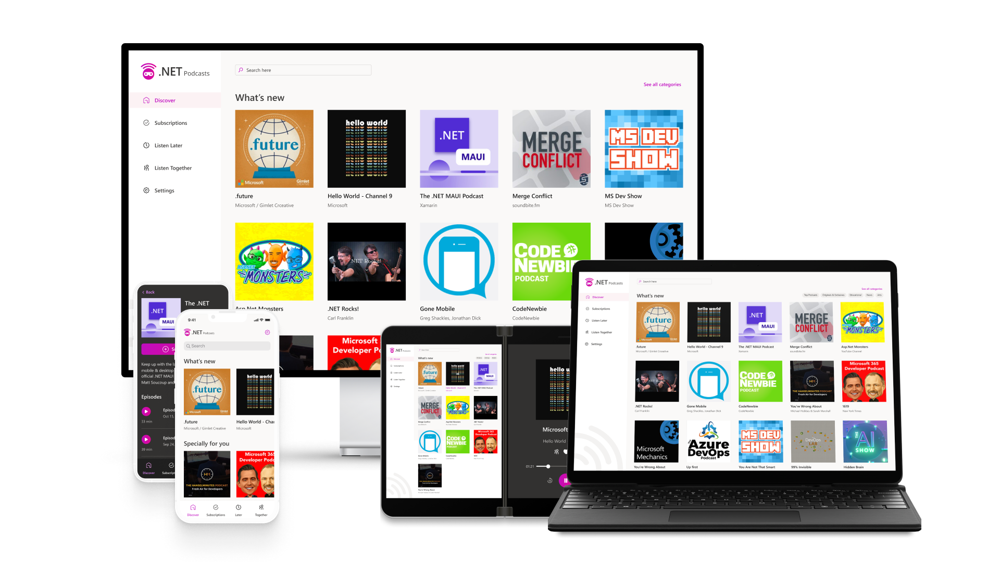
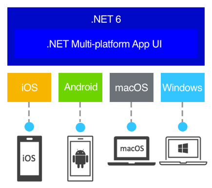

## 什么是.NET MAUI

> https://dotnet.microsoft.com/zh-cn/apps/maui

.NET Multi-platform App UI (.NET MAUI)是一个框架，用于在单个代码库中使用C#和XAML构建新式、多平台、本机编译的iOS、Android、macOS和Windows应用。

.NET MAUI使用最新的新式技术在Android、iOS、macOS和Windows上构建本机应用，将它们抽象为基于.NET 6构建的通用框架。

默认情况下，本机应用的外观与它们所属的操作系统类似，并且布局自动完全适应每个设备，无需额外代码。

平台API可直接从C#获得，以从单个跨平台API访问60多个平台功能，包括访问隔离存储、传感器、地理位置、相机等内容，但不会受到任何影响。

## 相关文档

* [乘风破浪，遇见最美Windows 11之现代Windows桌面应用开发 - 微软跨平台UI框架.NET MAUI，基于.NET 6构建的通用框架](https://www.cnblogs.com/taylorshi/p/16383164.html)

## 相关截图

